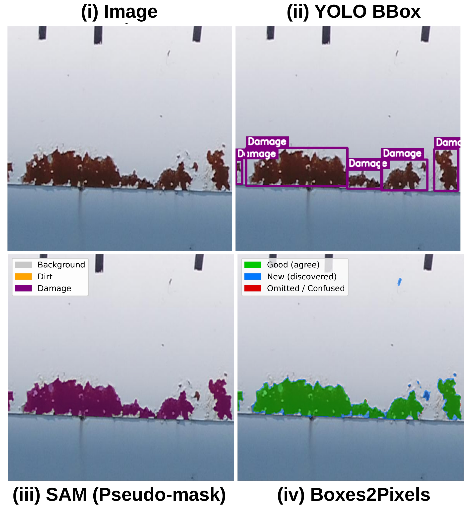

# Boxes2Pixels

<p align="center">
  
</p>

**Learning defect segmentation from noisy SAM masks**

<p align="center">
  <a href="https://arxiv.org/abs/2604.11162">
    
  </a>
  <a href="https://drive.google.com/file/d/1xxMCupm-VB2calqLJeQh_FDsncjhxepb/view?usp=sharing">
    
  </a>
  
</p>

Accepted to **AI4RWC @ CVPR 2026**.

Boxes2Pixels is a weakly supervised segmentation framework for wind turbine blade inspection. It learns pixel-level defect masks from bounding-box supervision by distilling SAM-generated pseudo-masks into a compact DINOv2-based student model.

The main model, `dino_final`, combines frozen DINOv2 ViT-S/14 features, BitFit adaptation, a lightweight detail branch, a binary defect head, and one-sided online self-correction to improve robustness under noisy pseudo-labels.

---

## Highlights

- Learns dense defect segmentation from bounding boxes.
- Uses SAM only offline to generate pseudo-masks.
- Does not require SAM at inference time.
- Uses frozen DINOv2 features with lightweight BitFit adaptation.
- Separates foreground localization from fine-grained defect classification.
- Recovers defects missed by the pseudo-mask teacher through conservative self-correction.

---

## Results

Evaluation is performed on a manually annotated wind turbine test split. All models are trained with the same box-only supervision via SAM pseudo-masks.

| Model | mIoU | Anomaly mIoU | Anomaly F1 | Binary IoU |
|---|---:|---:|---:|---:|
| U-Net | 0.7057 | 0.5629 | 0.7036 | 0.5427 |
| DeepLabV3-B2 | 0.6867 | 0.5342 | 0.6955 | 0.5331 |
| SegFormer-B2 | 0.7231 | 0.5881 | 0.6939 | 0.5312 |
| **Boxes2Pixels** | **0.7661** | **0.6523** | **0.7674** | **0.6226** |

Self-correction improves binary recall from **0.6195** to **0.8051**, helping recover sparse defects missed by the pseudo-mask teacher.

---

## Installation

```bash
conda create -n boxes2pixels python=3.10 -y
conda activate boxes2pixels
```

Install PyTorch for your CUDA version, then install the repo requirements:

```bash
pip install torch torchvision
pip install -r requirements.txt
```

The DINOv2 backbone is loaded through `torch.hub`, so the first run may require internet access.

---

## Dataset

The dataset is currently provided as a Google Drive zip:

[Download dataset](https://drive.google.com/file/d/1xxMCupm-VB2calqLJeQh_FDsncjhxepb/view?usp=sharing)

After downloading, unzip it so that the dataset root contains:

```text
dataset_dtu_final_split/
├── train/
│   ├── images/
│   └── masks/
├── val/
│   ├── images/
│   └── masks/
└── test/
    ├── images/
    ├── masks_refined/
    └── yolo_labels/        # optional, used for visualization
```

Training and validation masks are SAM-generated pseudo-masks. The refined test masks are used only for evaluation.

Classes:

```text
0 = Background
1 = Dirt
2 = Damage
```

---

## Training

Train the main Boxes2Pixels model:

```bash
python main.py \
  --project_root dataset_dtu_final_split \
  --results_root benchmark_results \
  --suite custom \
  --runs dino_final \
  --use_ema \
  --amp
```

---

## Baselines and ablations

Run the final benchmark suite:

```bash
python main.py \
  --project_root dataset_dtu_final_split \
  --results_root benchmark_results \
  --suite final \
  --use_ema \
  --amp
```

Run ablations:

```bash
python main.py \
  --project_root dataset_dtu_final_split \
  --results_root benchmark_results \
  --suite ablations \
  --use_ema \
  --amp
```

Run selected models:

```bash
python main.py \
  --project_root dataset_dtu_final_split \
  --results_root benchmark_results \
  --suite custom \
  --runs dino_final,dino_final_no_selfcorr \
  --use_ema \
  --amp
```

Available run names include:

```text
unet
deeplabv3_effb2
segformer_b2
dino_final
dino_final_no_selfcorr
abl_dino_no_detail
abl_dino_no_binary
abl_dino_no_selfcorr
```

---

## Outputs

Each run writes to:

```text
benchmark_results/<run_name>/
├── ckpt/
│   └── best.pth
├── pred_test/
│   └── *.png
├── metrics.json
└── run_spec.json
```

Aggregate existing results without retraining:

```bash
python main.py \
  --project_root dataset_dtu_final_split \
  --results_root benchmark_results \
  --aggregate_only \
  --make_vis
```

This creates summary files and optional visual comparisons under:

```text
benchmark_results/summary.csv
benchmark_results/summary.json
benchmark_results/_paper_vis/
```

---

## Method

Boxes2Pixels follows a box-to-pixel distillation pipeline:

1. Bounding boxes are converted into SAM pseudo-masks offline.
2. A DINOv2-based student is trained on the pseudo-masks.
3. A binary head learns defect-versus-background localization.
4. A fine head predicts background, dirt, and damage.
5. One-sided self-correction allows confident defect predictions to override background pseudo-labels.

At inference time, only the student model is used.

---

## Citation

```bibtex
@article{lendering2026boxes2pixels,
  title   = {Boxes2Pixels: Learning Defect Segmentation from Noisy SAM Masks},
  author  = {Lendering, Camile and Akdag, Erkut and Bondarev, Egor},
  journal = {arXiv preprint arXiv:2604.11162},
  year    = {2026}
}
```

---

## Acknowledgements

This work is supported by the ADVISOR ITEA 241007 project.

---